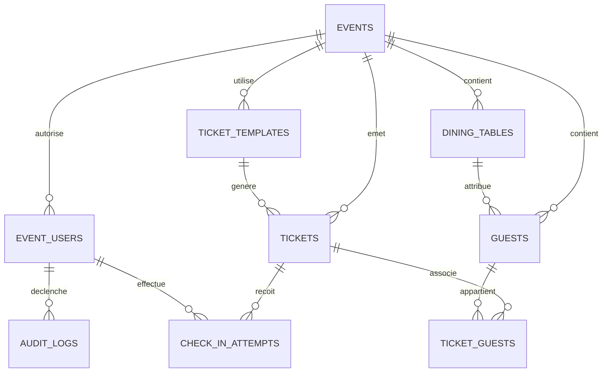

# Spécification détaillée de la base de données

> **Base cible :** PostgreSQL hébergé par Supabase.
>
> **Accès métier :** Prisma, exclusivement depuis les routes serveur Next.js.
>
> **But :** décrire sans ambiguïté les tables, colonnes, relations, contraintes, index et opérations transactionnelles nécessaires à l'application de billetterie de mariage.
>
> Les décisions métier ultérieures et prioritaires sont listées dans [Décisions métier finales](DECISIONS_METIER_FINALES.md).

## 1. Principes de modélisation

1. Une personne invitée est toujours stockée seule dans `guests`.
2. Un billet est une entité séparée ; il lie une ou deux personnes via `ticket_guests`.
3. Un billet `SINGLE` associe exactement une personne. Un billet `COUPLE` associe exactement deux personnes distinctes.
4. Un QR ne contient pas de données invité ; le jeton brut n'est jamais stocké dans la base.
5. La base conserve le hash du jeton QR et l'état du billet.
6. La validation d'entrée doit être atomique dans PostgreSQL.
7. Les données Supabase Auth restent dans le schéma `auth`, géré par Supabase. Les rôles applicatifs restent dans le schéma `public`.
8. Les suppressions des données métier sont évitées : privilégier statuts, révocations et traces d'audit.
9. Toutes les données métier sont rattachées à `event_id`, même si le MVP ne sert qu'un mariage. Cela garantit l'isolation et rend l'évolution multi-événements possible.

## 2. Schémas PostgreSQL

| Schéma | Propriétaire | Usage |
| --- | --- | --- |
| `auth` | Supabase Auth | Comptes, identités et sessions. Ne pas modifier directement. |
| `storage` | Supabase Storage | Métadonnées des fichiers. Ne pas utiliser pour les données métier. |
| `public` | Application | Toutes les tables définies dans ce document. |

## 3. Diagramme relationnel



## 4. Conventions partagées

### 4.1 Identifiants et dates

- Toutes les clés primaires sont des `uuid` générés par PostgreSQL avec `gen_random_uuid()`.
- Toutes les dates sont `timestamptz` et stockées en UTC.
- L'affichage convertit les dates vers le fuseau défini par l'événement, par exemple `Africa/Douala`.
- Les champs d'audit ont les noms `created_at`, `updated_at`, `deleted_at` lorsque pertinents.

### 4.2 Énumérations PostgreSQL

Créer les types suivants dans Prisma et PostgreSQL :

```text
event_status          = DRAFT | ACTIVE | ARCHIVED
event_role            = ADMIN | CONTROLLER
guest_status          = ACTIVE | CANCELLED | ARCHIVED
ticket_type           = SINGLE | COUPLE
ticket_status         = ACTIVE | USED | REVOKED | CANCELLED
check_in_result       = ACCEPTED | MANUAL_ACCEPTED | ALREADY_USED | INVALID | REVOKED | CANCELLED | DENIED
audit_action          = EVENT_UPDATED | TABLE_CREATED | TABLE_UPDATED | TABLE_DELETED |
                        GUEST_CREATED | GUEST_UPDATED | GUEST_CANCELLED |
                        TICKET_CREATED | TICKET_REISSUED | TICKET_REVOKED | TICKET_CANCELLED |
                        CONTROLLER_CREATED | CONTROLLER_DISABLED |
                        CHECK_IN_ACCEPTED | CHECK_IN_MANUAL_ACCEPTED
```

Utiliser des énumérations plutôt que des chaînes libres pour les états métier. Ne pas renommer ou supprimer une valeur en production sans migration planifiée.

## 5. Table `events`

### Rôle

Représente un mariage ou événement privé. Même avec un seul événement, cette table est obligatoire pour isoler les données.

| Colonne | Type PostgreSQL | Null | Règle / description |
| --- | --- | --- | --- |
| `id` | `uuid` | Non | Clé primaire, `gen_random_uuid()` |
| `name` | `varchar(160)` | Non | Nom visible de l'événement |
| `wedding_date` | `timestamptz` | Oui | Date/heure de référence, si connue |
| `venue_name` | `varchar(200)` | Oui | Lieu du mariage/réception |
| `timezone` | `varchar(64)` | Non | Défaut `Africa/Douala` ou fuseau choisi |
| `status` | `event_status` | Non | Défaut `DRAFT` |
| `created_at` | `timestamptz` | Non | Défaut `now()` |
| `updated_at` | `timestamptz` | Non | Mis à jour automatiquement |

### Contraintes et index

- Clé primaire : `events_pkey (id)`.
- Index : `events_status_idx (status)` si plusieurs événements sont gérés.
- `timezone` doit être une zone IANA valide, vérifiée au niveau application.

## 6. Table `event_users`

### Rôle

Associe un utilisateur Supabase Auth à un événement et détermine son rôle. Ne pas dupliquer le mot de passe, l'e-mail d'authentification ou les sessions dans cette table.

| Colonne | Type PostgreSQL | Null | Règle / description |
| --- | --- | --- | --- |
| `id` | `uuid` | Non | Clé primaire |
| `event_id` | `uuid` | Non | FK vers `events.id` |
| `auth_user_id` | `uuid` | Non | FK logique vers `auth.users.id` ; relation Prisma gérée avec prudence selon connecteur |
| `display_name` | `varchar(120)` | Non | Nom affiché dans les journaux |
| `role` | `event_role` | Non | `ADMIN` ou `CONTROLLER` |
| `is_active` | `boolean` | Non | Défaut `true` |
| `last_login_at` | `timestamptz` | Oui | Mis à jour après connexion si souhaité |
| `created_at` | `timestamptz` | Non | Défaut `now()` |
| `updated_at` | `timestamptz` | Non | Mis à jour automatiquement |

### Contraintes et index

- FK : `event_id -> events(id) ON DELETE RESTRICT`.
- Unique : `(event_id, auth_user_id)`.
- Index : `(event_id, role, is_active)` pour les vérifications de permission.
- Au moins un administrateur actif doit subsister dans un événement. Cette règle est vérifiée dans une transaction côté serveur avant désactivation/suppression ; ne pas permettre la désactivation du dernier admin.

## 7. Table `dining_tables`

### Rôle

Contient les tables de réception et leur capacité. La capacité est exprimée en personnes, jamais en billets.

| Colonne | Type PostgreSQL | Null | Règle / description |
| --- | --- | --- | --- |
| `id` | `uuid` | Non | Clé primaire |
| `event_id` | `uuid` | Non | FK vers événement |
| `label` | `varchar(80)` | Non | Exemple : `12`, `Table d'honneur` |
| `capacity` | `smallint` | Non | Entier positif, maximum recommandé 200 |
| `created_at` | `timestamptz` | Non | Défaut `now()` |
| `updated_at` | `timestamptz` | Non | Mis à jour automatiquement |

### Contraintes et index

- FK : `event_id -> events(id) ON DELETE RESTRICT`.
- Unique : `(event_id, label)`.
- Check : `capacity > 0 AND capacity <= 200`.
- Index : `(event_id, label)`.

### Capacité

Le nombre de places attribuées est calculé par :

```sql
COUNT(*) FROM guests
WHERE event_id = :event_id
  AND table_id = :table_id
  AND status = 'ACTIVE'
```

Ne pas stocker un compteur mutable `occupied_count` comme source de vérité. Il peut être calculé à la demande ou matérialisé avec prudence si le volume l'exige.

## 8. Table `guests`

### Rôle

Stocke chaque personne invitée individuellement. Un couple est composé de deux lignes distinctes ici.

| Colonne | Type PostgreSQL | Null | Règle / description |
| --- | --- | --- | --- |
| `id` | `uuid` | Non | Clé primaire |
| `event_id` | `uuid` | Non | FK vers événement |
| `last_name` | `varchar(120)` | Non | Nom |
| `first_names` | `varchar(160)` | Non | Un ou plusieurs prénoms |
| `table_id` | `uuid` | Oui | FK vers `dining_tables.id` |
| `status` | `guest_status` | Non | Défaut `ACTIVE` |
| `notes` | `text` | Oui | Facultatif ; ne pas afficher au contrôleur par défaut |
| `created_at` | `timestamptz` | Non | Défaut `now()` |
| `updated_at` | `timestamptz` | Non | Mis à jour automatiquement |

### Contraintes et index

- FK : `event_id -> events(id) ON DELETE RESTRICT`.
- FK : `table_id -> dining_tables(id) ON DELETE SET NULL`.
- Check : `length(trim(last_name)) > 0` et `length(trim(first_names)) > 0`.
- Index de liste : `(event_id, status, table_id)`.
- Index de recherche : `(event_id, lower(last_name), lower(first_names))`. Pour recherche plus tolérante, ajouter plus tard `pg_trgm` et des index GIN ; ne pas l'ajouter sans besoin réel.

### Cohérence événement/table

Une personne ne doit pas pouvoir référencer une table d'un autre événement. PostgreSQL ne l'impose pas avec deux FKs simples. Garantir cette règle avec l'une des deux options suivantes :

1. Ajouter une contrainte composite `UNIQUE (event_id, id)` sur `dining_tables` et une FK composite `(event_id, table_id)` depuis `guests` ; **option recommandée**.
2. Vérifier dans le service métier transactionnel avant toute écriture.

L'option 1 est préférable pour empêcher une erreur même si une future route API est mal implémentée.

## 9. Table `ticket_templates`

### Rôle

Référence le template PDF d'un événement et la zone QR configurée. Le fichier lui-même est dans Supabase Storage privé.

| Colonne | Type PostgreSQL | Null | Règle / description |
| --- | --- | --- | --- |
| `id` | `uuid` | Non | Clé primaire |
| `event_id` | `uuid` | Non | FK vers événement |
| `storage_bucket` | `varchar(80)` | Non | Nom du bucket privé, ex. `ticket-templates` |
| `storage_path` | `text` | Non | Chemin du PDF dans Storage |
| `original_filename` | `varchar(255)` | Non | Nom d'origine à afficher |
| `page_number` | `smallint` | Non | Défaut `1`, index de page du template |
| `qr_x` | `numeric(10,2)` | Non | Coordonnée X en points PDF, origine bas-gauche |
| `qr_y` | `numeric(10,2)` | Non | Coordonnée Y en points PDF, origine bas-gauche |
| `qr_size` | `numeric(10,2)` | Non | Taille carrée en points PDF |
| `is_active` | `boolean` | Non | Un seul template actif par événement |
| `created_by_user_id` | `uuid` | Oui | FK vers `event_users.id` |
| `created_at` | `timestamptz` | Non | Défaut `now()` |
| `updated_at` | `timestamptz` | Non | Mis à jour automatiquement |

### Contraintes et index

- FK : `event_id -> events(id) ON DELETE RESTRICT`.
- Check : `page_number >= 1`, `qr_x >= 0`, `qr_y >= 0`, `qr_size >= 70`.
- Le minimum de 70 points représente environ 25 mm ; la configuration validée actuelle est proche de 88 points, soit environ 31 mm.
- Index partiel unique : un seul template actif par événement.

```sql
CREATE UNIQUE INDEX ticket_templates_one_active_per_event
ON ticket_templates (event_id)
WHERE is_active = true;
```

### Fichiers

- Template source : chemin privé, par exemple `events/{event_id}/templates/{template_id}/source.pdf`.
- PDF généré : ne le stocker que si nécessaire ; sinon générer à la demande.
- Ne jamais rendre un bucket public uniquement pour permettre le téléchargement. Utiliser une URL signée à durée courte.

## 10. Table `tickets`

### Rôle

Représente le billet et son QR à usage unique. Un billet ne contient pas les noms ; ils sont obtenus par `ticket_guests` puis `guests`.

| Colonne | Type PostgreSQL | Null | Règle / description |
| --- | --- | --- | --- |
| `id` | `uuid` | Non | Clé primaire interne |
| `event_id` | `uuid` | Non | FK vers événement |
| `template_id` | `uuid` | Oui | Template utilisé pour l'émission du PDF |
| `short_code` | `varchar(16)` | Non | Code de secours humain, non secret |
| `type` | `ticket_type` | Non | `SINGLE` ou `COUPLE` |
| `status` | `ticket_status` | Non | Défaut `ACTIVE` |
| `token_hash` | `char(64)` | Non | SHA-256 hexadécimal du jeton QR ; jamais le jeton brut |
| `version` | `integer` | Non | Défaut `1`, augmente lors d'une réémission |
| `issued_at` | `timestamptz` | Non | Défaut `now()` |
| `checked_in_at` | `timestamptz` | Oui | Heure de l'entrée acceptée |
| `checked_in_by_user_id` | `uuid` | Oui | Contrôleur ayant accepté l'entrée |
| `revoked_at` | `timestamptz` | Oui | Heure de révocation |
| `revoked_reason` | `varchar(300)` | Oui | Perte, remplacement, annulation, etc. |
| `created_at` | `timestamptz` | Non | Défaut `now()` |
| `updated_at` | `timestamptz` | Non | Mis à jour automatiquement |

### Contraintes et index

- FK : `event_id -> events(id) ON DELETE RESTRICT`.
- FK : `template_id -> ticket_templates(id) ON DELETE SET NULL`.
- FK : `checked_in_by_user_id -> event_users(id) ON DELETE SET NULL`.
- Unique : `token_hash` globalement. Un jeton aléatoire 128 bits rend une collision négligeable ; l'unicité reste obligatoire.
- Unique : `(event_id, short_code)`.
- Index scan : `(token_hash, status, checked_in_at)`.
- Index liste : `(event_id, status, type, issued_at DESC)`.
- Check : `version >= 1`.
- Check de cohérence :
  - `status = 'USED'` implique `checked_in_at IS NOT NULL`.
  - `status IN ('ACTIVE', 'REVOKED', 'CANCELLED')` implique `checked_in_at IS NULL`.
  - `status = 'REVOKED'` implique `revoked_at IS NOT NULL`.
  - Un billet `USED` ne doit pas être révoqué par le flux ordinaire.

### Jeton QR

Générer 32 octets aléatoires avec une API cryptographique (`crypto.randomBytes(32)`), les encoder pour l'URL, puis stocker :

```text
token_hash = SHA-256(token_brut + secret_serveur_optionnel)
```

Ne pas utiliser UUID séquentiel, ID base, code court ou nom d'invité comme jeton QR.

## 11. Table `ticket_guests`

### Rôle

Table de liaison entre billets et personnes. Elle conserve l'historique : un ancien billet révoqué reste lié à ses personnes, mais un nouveau billet peut être créé après révocation.

| Colonne | Type PostgreSQL | Null | Règle / description |
| --- | --- | --- | --- |
| `ticket_id` | `uuid` | Non | FK vers `tickets.id` |
| `guest_id` | `uuid` | Non | FK vers `guests.id` |
| `position` | `smallint` | Non | `1` ou `2` ; ordre d'affichage stable |
| `created_at` | `timestamptz` | Non | Défaut `now()` |

### Clés et contraintes

- Clé primaire composite : `(ticket_id, guest_id)`.
- Unique : `(ticket_id, position)`.
- Check : `position IN (1, 2)`.
- FK : `ticket_id -> tickets(id) ON DELETE RESTRICT`.
- FK : `guest_id -> guests(id) ON DELETE RESTRICT`.
- Index : `(guest_id)` pour retrouver le billet d'une personne.

### Contraintes métier à garantir transactionnellement

PostgreSQL ne peut pas exprimer avec un simple `CHECK` que le nombre de lignes liées dépend de `tickets.type`. Implémenter une fonction/contrainte différée ou un service transactionnel très strict qui garantit :

- Un `SINGLE` a exactement une association après validation de la transaction.
- Un `COUPLE` a exactement deux associations après validation de la transaction.
- Les deux personnes d'un `COUPLE` sont distinctes.
- Chaque personne a le même `event_id` que le billet.
- Les deux personnes d'un `COUPLE` ont le même `table_id` non nul au moment de la création.
- Aucune personne n'est déjà liée à un autre billet `ACTIVE`.

**Recommandation :** créer les billets uniquement via un service `createTicket` dans une transaction Prisma avec verrouillage des lignes `guests` sélectionnées. Ajouter ensuite des contraintes/triggers PostgreSQL différés pour les invariants les plus critiques. Ne jamais insérer directement dans `tickets` et `ticket_guests` depuis le navigateur.

## 12. Table `check_in_attempts`

### Rôle

Journal immuable de toutes les tentatives de contrôle. Un QR inconnu n'a pas de `ticket_id`, mais son essai est tout de même tracé avec un hash distinct et limité.

| Colonne | Type PostgreSQL | Null | Règle / description |
| --- | --- | --- | --- |
| `id` | `uuid` | Non | Clé primaire |
| `event_id` | `uuid` | Non | FK vers événement |
| `ticket_id` | `uuid` | Oui | FK vers billet lorsque identifié |
| `operator_user_id` | `uuid` | Oui | FK vers `event_users.id` |
| `result` | `check_in_result` | Non | Résultat de la tentative |
| `is_manual` | `boolean` | Non | Défaut `false` |
| `manual_reason` | `varchar(300)` | Oui | Obligatoire si `is_manual = true` |
| `scanned_at` | `timestamptz` | Non | Défaut `now()` |
| `device_label` | `varchar(120)` | Oui | Nom facultatif de l'appareil/point accueil |
| `unknown_token_hash` | `char(64)` | Oui | Hash d'un QR inconnu ; jamais le jeton brut |
| `metadata` | `jsonb` | Oui | Données techniques minimales ; jamais données personnelles inutiles |

### Contraintes et index

- FKs : `event_id`, `ticket_id`, `operator_user_id` avec `ON DELETE RESTRICT` ou `SET NULL` pour l'opérateur.
- Check : `is_manual = true` implique `manual_reason IS NOT NULL AND length(trim(manual_reason)) > 0`.
- Check : `result = 'MANUAL_ACCEPTED'` implique `is_manual = true`.
- Index historique : `(event_id, scanned_at DESC)`.
- Index billet : `(ticket_id, scanned_at DESC)`.
- Index opérateur : `(operator_user_id, scanned_at DESC)`.
- Index résultat : `(event_id, result, scanned_at DESC)`.

### Unicité d'entrée acceptée

Ajouter un index unique partiel :

```sql
CREATE UNIQUE INDEX check_in_one_accepted_per_ticket
ON check_in_attempts (ticket_id)
WHERE result IN ('ACCEPTED', 'MANUAL_ACCEPTED');
```

Cette contrainte est une seconde protection derrière l'`UPDATE` atomique du billet.

## 13. Table `audit_logs`

### Rôle

Journal des actions d'administration. Il ne remplace pas `check_in_attempts`, qui est spécialisé dans les scans.

| Colonne | Type PostgreSQL | Null | Règle / description |
| --- | --- | --- | --- |
| `id` | `uuid` | Non | Clé primaire |
| `event_id` | `uuid` | Non | FK vers événement |
| `actor_user_id` | `uuid` | Oui | FK vers `event_users.id` |
| `action` | `audit_action` | Non | Nature de l'action |
| `entity_type` | `varchar(80)` | Non | `guest`, `ticket`, `table`, `template`, `event_user`, etc. |
| `entity_id` | `uuid` | Oui | Identifiant de l'entité concernée |
| `before_data` | `jsonb` | Oui | État minimal avant modification ; pas de secrets |
| `after_data` | `jsonb` | Oui | État minimal après modification ; pas de secrets |
| `created_at` | `timestamptz` | Non | Défaut `now()` |

### Règles

- L'API n'expose aucune opération de suppression/modification de logs aux contrôleurs.
- Ne pas y stocker de jeton QR, mot de passe, session ou clé Supabase.
- Index : `(event_id, created_at DESC)`, `(entity_type, entity_id)` et `(actor_user_id, created_at DESC)`.

## 14. Relations et règles de suppression

| Parent | Enfant | Politique |
| --- | --- | --- |
| Event | Toutes données métier | `RESTRICT` ; ne pas supprimer un événement contenant des données |
| DiningTable | Guest | `SET NULL` techniquement, mais l'UI bloque la suppression si des invités actifs y sont associés |
| Guest | TicketGuest | `RESTRICT` ; conserver historique des billets |
| Ticket | TicketGuest / CheckInAttempt | `RESTRICT` ; un billet est historisé |
| TicketTemplate | Ticket | `SET NULL` ; un billet historique reste lisible sans dépendre du template actif |
| EventUser | CheckInAttempt / AuditLog | `SET NULL` possible pour préserver traces si compte désactivé/supprimé |

Ne pas exposer une suppression définitive de billet ou d'invité dans le MVP.

## 15. Transactions critiques à implémenter

### 15.1 Créer une table

```text
Vérifier rôle ADMIN
-> vérifier unicité label dans l'événement
-> insérer dining_tables
-> insérer audit_logs TABLE_CREATED
-> commit
```

### 15.2 Affecter/changer une table pour un invité

```text
Vérifier rôle ADMIN
-> verrouiller invité et nouvelle table
-> vérifier même événement
-> compter personnes actives de la nouvelle table
-> vérifier capacité
-> si invité dans un Couple actif, vérifier cohérence avec le partenaire
-> mettre à jour guests.table_id
-> audit GUEST_UPDATED
-> commit
```

Le flux doit refuser un changement qui rendrait les deux membres d'un Couple à des tables différentes. L'administrateur doit déplacer les deux personnes de manière cohérente ou modifier le billet suivant un workflow explicite.

### 15.3 Créer un billet

```text
Vérifier rôle ADMIN
-> verrouiller les personnes sélectionnées
-> vérifier statut ACTIVE et même événement
-> vérifier absence de billet ACTIVE pour chaque personne
-> si COUPLE : vérifier 2 personnes distinctes et même table
-> générer jeton cryptographique + hash
-> créer tickets ACTIVE
-> créer 1 ou 2 ticket_guests
-> créer audit TICKET_CREATED
-> commit
-> générer le PDF après commit ou dans un job fiable
```

Ne pas générer le PDF avant la création réussie du billet. Si la génération échoue, le billet reste actif mais l'UI doit permettre un nouvel essai de génération sans modifier son jeton.

### 15.4 Scanner/valider un billet

```text
Vérifier session et rôle CONTROLLER/ADMIN
-> hasher le jeton reçu
-> UPDATE ticket conditionnel WHERE token_hash, status ACTIVE, checked_in_at NULL
-> si une ligne retournée : statut USED + checked_in_at + opérateur
-> insérer CheckInAttempt ACCEPTED dans même transaction
-> insérer AuditLog si souhaité
-> commit
-> lire personnes, type et table pour réponse UI
```

Si aucune ligne n'est retournée, lire un minimum d'état afin de classer la réponse puis insérer `ALREADY_USED`, `REVOKED`, `CANCELLED` ou `INVALID`. Ne pas accepter sur base d'un état lu avant l'update.

### 15.5 Validation manuelle

Même transaction que le scan normal, avec `is_manual = true`, motif obligatoire, résultat `MANUAL_ACCEPTED` et index unique de protection. Le contrôleur ne peut le faire que si la permission est explicitement activée ; sinon réserver cette action à l'admin.

### 15.6 Réémettre un billet perdu

```text
Vérifier rôle ADMIN
-> verrouiller ancien billet
-> exiger status ACTIVE et non utilisé
-> passer ancien billet à REVOKED avec date/motif
-> générer nouveau jeton/hash
-> créer nouveau ticket ACTIVE et associations mêmes invités
-> audit TICKET_REISSUED
-> commit
-> générer nouveau PDF
```

L'ancien token est définitivement invalide après commit. Ne jamais modifier le token d'une ligne historique.

## 16. Sécurité Supabase et accès base

### 16.1 Variables d'environnement

| Variable | Accessible navigateur ? | Usage |
| --- | --- | --- |
| `NEXT_PUBLIC_SUPABASE_URL` | Oui | Client Auth/SDK public |
| `NEXT_PUBLIC_SUPABASE_ANON_KEY` | Oui | Client Auth/SDK public avec politiques appropriées |
| `SUPABASE_SERVICE_ROLE_KEY` | Non | Serveur uniquement, tâches Storage administratives si nécessaires |
| `DATABASE_URL` | Non | Prisma runtime, URL poolée Supabase |
| `DIRECT_URL` | Non | Prisma migrations/commandes directes si configuré |
| `QR_TOKEN_PEPPER` | Non | Secret optionnel de hash supplémentaire |

### 16.2 RLS et Prisma

- Le navigateur ne doit jamais accéder directement aux tables métier avec le client Supabase dans le MVP.
- Toutes les mutations métier passent par Next.js + Prisma après vérification de session et rôle.
- Activer RLS sur les tables exposables via l'API Supabase et ne créer aucune politique permissive anonyme.
- Le rôle Prisma serveur peut contourner RLS selon la connexion utilisée ; c'est pourquoi l'autorisation dans le service serveur est obligatoire.
- Ne jamais exposer la clé de service ou `DATABASE_URL` au client.

### 16.3 Storage

- Bucket template et bucket PDF privés.
- Chemins segmentés par événement.
- Téléchargement via URL signée courte ou route serveur autorisée.
- Validation MIME et taille maximale lors d'un import PDF/CSV.

## 17. Correspondance Prisma attendue

Le schéma Prisma doit refléter les relations de ce document. À haut niveau :

```text
Event 1--n EventUser
Event 1--n DiningTable
Event 1--n Guest
Event 1--n TicketTemplate
Event 1--n Ticket
Event 1--n CheckInAttempt
Event 1--n AuditLog

DiningTable 1--n Guest
Ticket 1--n TicketGuest
Guest 1--n TicketGuest
Ticket 1--n CheckInAttempt
EventUser 1--n CheckInAttempt
```

Définir les `@@index`, `@@unique` et enums dans Prisma lorsqu'ils sont directement pris en charge. Les index partiels, triggers différés et politiques RLS peuvent nécessiter des migrations SQL personnalisées en complément de Prisma. Ne pas supposer qu'un schéma Prisma seul exprime tous les invariants PostgreSQL décrits ici.

## 18. Migration et seed de développement

### Migrations

1. Initialiser les extensions nécessaires, notamment `pgcrypto` pour UUID si elle n'est pas déjà active.
2. Créer les enums.
3. Créer tables dans l'ordre : `events`, `event_users`, `dining_tables`, `guests`, `ticket_templates`, `tickets`, `ticket_guests`, `check_in_attempts`, `audit_logs`.
4. Ajouter index, index partiels et checks.
5. Ajouter triggers `updated_at` et contraintes différées nécessaires.
6. Activer/polir les politiques RLS sans empêcher Prisma serveur de fonctionner.

### Seed local

Créer un seed explicitement réservé au développement avec :

- Un événement de démonstration.
- Un administrateur et deux contrôleurs fictifs.
- Des tables avec capacités différentes.
- Des invités seuls et couples formés via billets.
- Billets actifs, utilisés, révoqués et annulés.
- Quelques scans historiques.

Ne jamais charger les données réelles des invités dans un seed ou un dépôt Git.

## 19. Checklist de revue base de données

- [ ] Aucun QR ne contient de données personnelles.
- [ ] Le jeton QR brut n'est jamais persisté.
- [ ] Tous les tables métier ont `event_id` et une isolation d'événement vérifiée.
- [ ] Une personne est stockée indépendamment d'un billet.
- [ ] Les billets Couple lient exactement deux personnes distinctes de la même table.
- [ ] Un invité ne peut pas être lié à deux billets actifs.
- [ ] Une entrée acceptée est unique par billet même en cas de scans simultanés.
- [ ] Les opérations de scan, création, révocation et réémission sont transactionnelles.
- [ ] Les logs et billets historiques ne sont pas supprimés par les contrôleurs.
- [ ] Les clés Supabase, URLs de base et secrets QR restent côté serveur.
- [ ] Les index supportent les recherches et scans principaux.
- [ ] Les migrations Prisma et SQL complémentaire sont versionnées dans Git.
